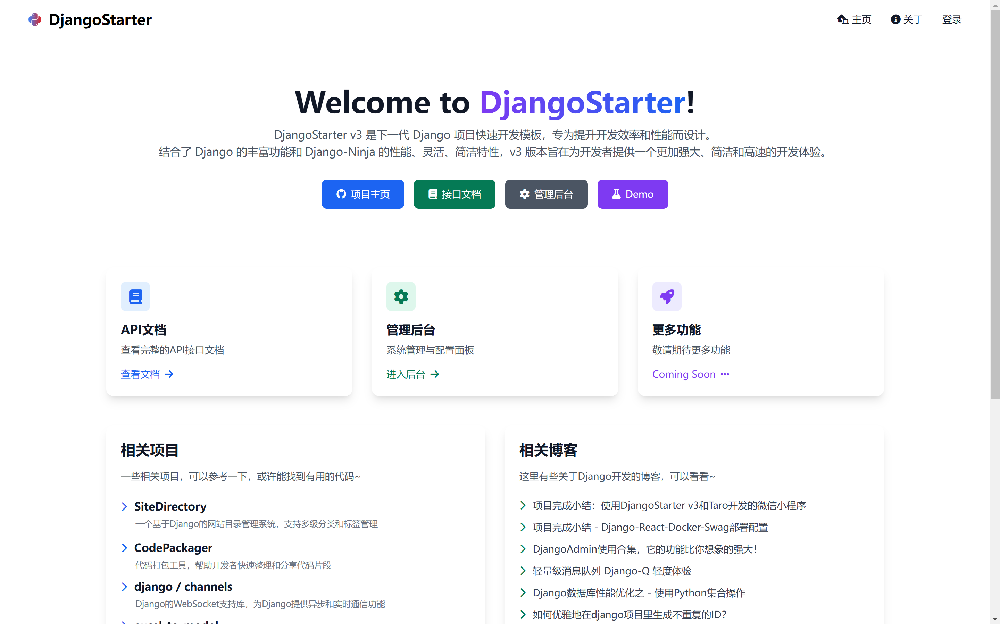
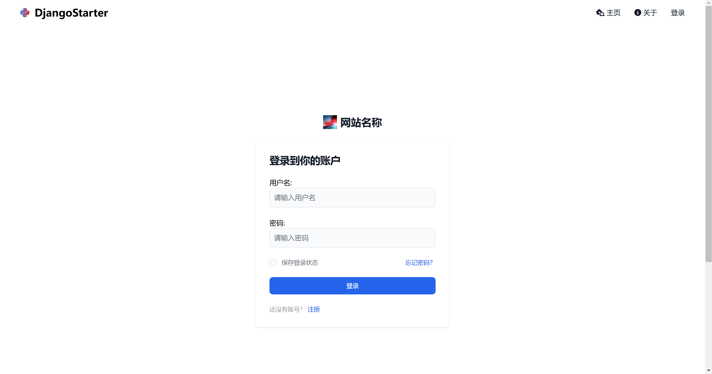
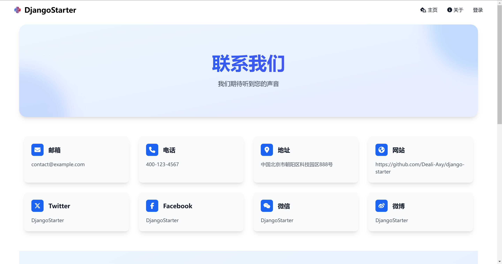
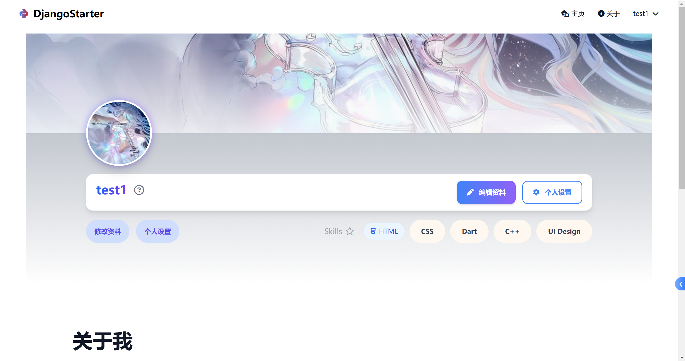
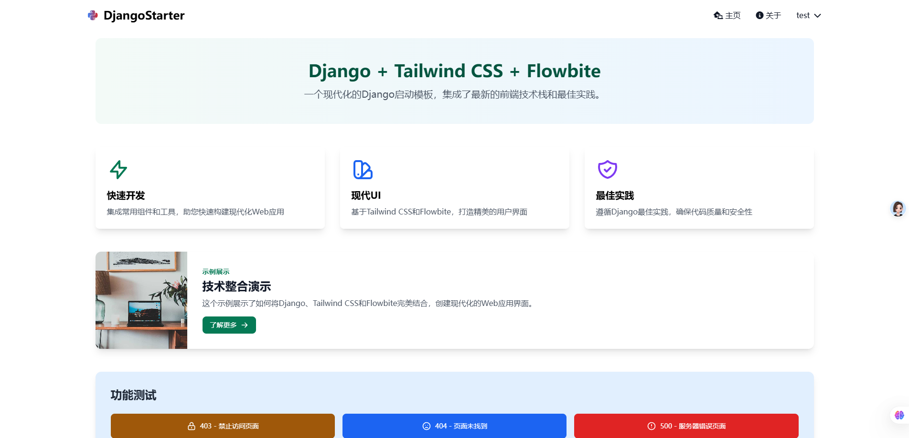

# DjangoStarter v3 · AI 原生全栈框架

面向独立开发者与小团队的 AI+全栈脚手架，用最少样板代码快速把想法做成可上线的产品。

基于 Django 5 + Django-Ninja（类型安全 API）+ HTMX/Alpine/Tailwind，内建认证、安全、中间件、代码生成、容器化与观测，把时间全部留给业务。

为 AI 而设计：为 LLM 接入、向量检索/嵌入、函数调用（Tools/Actions）、异步任务与流式响应预留清晰的扩展点与最佳实践路径，轻松把你的应用升级为 AI 驱动。

典型场景：个人/独立产品 MVP、企业内部工具、数据看板、以及各类 AI Agent/助手的后端与管理界面。

在 AI 时代，用 Django 的可靠性 + Ninja 的速度，零阻力从 0 到 1，再从 1 到 100。
更多新版本的细节，可以查看这些博客文章:

- [DjangoStarter v3版本开发笔记](https://blog.deali.cn/Blog/Post/a21ab29f70708e15)
- [AI 加持下的 DjangoStarter v3.1 版本开发](https://blog.deali.cn/Blog/Post/1f6ce0f31ba1214a)

## 截图预览

### 主页

<table style="width: 100%; table-layout: fixed;">
  <thead>
    <tr>
      <th style="width: 50%;">主页</th>
      <th style="width: 50%;">后台主页</th>
    </tr>
  </thead>
  <tbody>
    <tr>
      <td></td>
      <td></td>
    </tr>
  </tbody>
</table>


### 其他页面


| 登录页面                     | 联系我们                     |
| ---------------------------- | ---------------------------- |
|    |  |
| 个人页面                     | Demo页面                     |
|  |     |


## 历史版本

- [v1](https://github.com/Deali-Axy/DjangoStarter/tree/v1)
- [v2](https://github.com/Deali-Axy/DjangoStarter/tree/v2)

## 核心特性

- **Django Ninja 集成**：采用 Django Ninja 替代传统的 Django Rest Framework，为 API 开发带来了性能优化和更简洁的编码体验。利用 Python 类型提示，自动生成交互式 API 文档，不再需要 drf-yasg 那一堆繁琐的手动配置文档，同时提升了代码的可读性和维护性。
- **增强的安全性**：内置了多项安全功能，包括但不限于 Admin 登录验证码、IP 限制等，确保应用的安全性。
- **代码自动生成**：v3 版本进一步优化了代码生成器，丢掉了 DRF 这个包袱，只需要定义模型，就可以生成 schema 以及 RESTFul API，还能根据定义自动创建测试用例，大大提高开发效率。
- **随机种子数据生成**：v3 版本内置 seed 模块，支持为已有模型自动填充假数据，方便开发测试。
- **模块化项目结构**：推出了更加模块化的项目结构设计，方便开发者根据需要添加或移除功能模块，使项目维护更为简单。
- **现代化前端集成**：采用 **TailwindCSS v4 + DaisyUI v5** 构建 UI，移除 Flowbite，支持 Light/Dark 多主题切换。使用 **Alpine.js** 处理前端交互，结合 HTMX 实现 SPA 级体验。以及利用 NPM 和 gulp 管理前端资源，帮助开发者打造富交互式的用户界面。
- **容器化支持**：内置 Dockerfile 和 docker-compose.yml 配置，简化了容器化部署的过程，支持一键部署到任何支持 Docker 的环境。
- **详尽的文档与社区支持**：提供全面的文档和指南，覆盖从项目启动到部署的每一个步骤。同时，基于活跃的 Django 开源社区，开发者可以轻松获取支持和反馈。

## 适用场景

DjangoStarter v3 是为那些追求高效开发流程、重视应用性能与安全性的 Django 开发者设计的。无论是构建复杂的企业级应用、快速开发 MVP 还是学习最佳实践，DjangoStarter v3 都是一个优秀的选择。

## features

- **业务代码生成器**（新）
- admin后台安全限制中间件（需手动启用）
- 非debug模式下管理员可以查看报错信息（需手动启用）
- 自定义URL前缀
- 支持Docker部署（使用`docker-compose`方式）
- 支持uWsgi部署，支持uWsgi自动重启
- 默认启用`CORS_ALLOW`实现接口跨域
- 基于SimpleUI定制的管理后台
- 管理后台支持登录验证码和登录尝试次数限制
- 集成Django-Ninja实现RESTFul API
- 配置模块`settings.py`拆分，支持多环境配置
- 默认使用Redis缓存
- 默认集成Swagger文档，开箱即用，无需额外配置
- 集成了多种外部登录功能
- [集成微信SDK，支持(企业)微信登录，详见博客](https://www.cnblogs.com/deali/p/16110129.html)
- [接口返回值统一包装，详见博客](https://www.cnblogs.com/deali/p/16094959.html)
- [集成NPM和Gulp管理前端资源，详见博客](https://www.cnblogs.com/deali/p/16094743.html)
- [封装了常用的三种分页功能，详见博客](https://www.cnblogs.com/deali/p/16132905.html)
- [重写admin主页，界面更美观，详见博客](https://www.cnblogs.com/deali/p/16418020.html)
- 封装了简单的本地配置中心

## v3版本介绍

v2版本已经定下了大体的框架，v3的主要改动是将 RestFramework 换成了 django-ninja ，在 Django 里实现了 FastApi 风格的接口。

其他的功能目前大概是这些：

- 新的自动代码生成功能
- 完善了单元测试和集成测试，搭配代码生成，可以为每个应用自动生成 crud 的测试用例
- 随机种子数据，目前使用 faker 实现假数据，打算进一步实现类似 EFCore 的种子数据机制，使假数据更自然
- 新的登录接口
- 多种第三方登录接入（目前接了微信、小程序、企微）
- 使用 TailwindCSS v4 + DaisyUI 重构前端，提供精美的现代化 UI 组件与布局，支持多主题切换
- 拆分 settings 配置，像 AspNetCore 那样支持多个环境配置
- 更换了包管理器为 uv

功能持续更新中，我会同步发在博客，欢迎关注。

## 文件结构

```sql
 DjangoStarter
 ├─ media # 用户上传的文件
 ├─ src # 主要源码
 │  ├─ apps # 所有应用
 │  │  ├─ account # 用户相关的代码，包括登录接口
 │  │  ├─ demo # 示例应用
 │  │  └─ __init__.py
 │  ├─ config # Django项目配置
 │  │  ├─ settings # 拆分的settings模块
 │  │  ├─ __init__.py
 │  │  ├─ apis.py # ninja API 配置
 │  │  ├─ asgi.py
 │  │  ├─ env_init.py # 环境初始化
 │  │  ├─ urls.py # 路由配置文件
 │  │  ├─ urls_root.py # DjangoStarter的顶层路由配置，用于实现地址前缀配置
 │  │  └─ wsgi.py
 │  ├─ django_starter # 框架代码
 │  │  ├─ contrib # 封装好的组件
 │  │  ├─ db # 数据库功能（比如 Model 基类）
 │  │  ├─ http # 接口相关（如 API 接口返回值包装）
 │  │  ├─ middleware # 中间件（IP限制、错误处理等功能）
 │  │  ├─ __init__.py
 │  │  ├─ apis.py
 │  │  ├─ constants.py
 │  │  ├─ urls.py
 │  │  └─ utilities.py
 │  ├─ static # 静态文件
 │  │  ├─ admin
 │  │  └─ css
 │  ├─ templates # Django模板
 │  │  ├─ demo
 │  │  └─ _base.html
 │  ├─ Dockerfile
 │  ├─ docker-compose.yml
 │  ├─ manage.py
 │  ├─ test.py
 │  └─ uwsgi.ini
 ├─ static-dist # 运行collectstatic命令后把所有静态文件都保存到这个文件夹
 ├─ .gitignore
 ├─ LICENSE
 ├─ README.md
 ├─ clean_pycache.py # 运行后可以清理 __pycache__ 文件
 ├─ gulpfile.js
 ├─ package.json
 ├─ uv.lock
 ├─ pnpm-lock.yaml
 ├─ pyproject.toml
 └─ tailwind.config.js
```

## 快速开始

### 入门文档

如果你此前从未接触过 Django ，建议先阅读 [Django 官方文档](https://docs.djangoproject.com/en/5.0/) ，了解 Django 的基本概念和用法。

以下是 DjangoStarter v3 的快速入门文档：

- [零基础快速入门](docs/quick-start.md)
- [前端零基础友好入门指南](docs/frontend-quick-start.md)

### clone代码

master分支是最新的代码，正处在活跃开发中，不保证生产稳定性，欢迎大家提issue。

当前最新生产版本是 v3.3.0，使用以下命令克隆代码：

```bash
git clone --branch v3.3.0 --depth 1 https://github.com/Deali-Axy/DjangoStarter.git
```

### 包管理器

从 v3.4 版本开始，全面切换为使用 [uv](https://github.com/astral-sh/uv) 管理 Python 环境和依赖。uv 是一个极速的 Python 包安装器和解析器，使用 Rust 编写，旨在替代 pip、pip-tools、pipx、poetry、pyenv、twine、virtualenv 等工具。

首先需要安装 uv：

```bash
# MacOS / Linux
curl -LsSf https://astral.sh/uv/install.sh | sh

# Windows
powershell -c "irm https://astral.sh/uv/install.ps1 | iex"
```

更多安装方式请参考 [uv 官方文档](https://docs.astral.sh/uv/getting-started/installation/)。

### Just 命令运行器

本项目使用 [just](https://github.com/casey/just) 作为命令运行器，方便执行常用的开发命令。

安装 just：

```bash
# Windows (使用 winget)
winget install -e --id Casey.Just

# Windows (使用 scoop)
scoop install just

# MacOS / Linux
curl --proto '=https' --tlsv1.2 -sSf https://just.systems/install.sh | bash -s -- --to /usr/local/bin
```

常用命令：

- `just` 或 `just --list`: 列出所有可用命令
- `just mm`: 生成数据库迁移文件 (`makemigrations`)
- `just migrate`: 执行数据库迁移 (`migrate`)
- `just db-sync`: 生成并执行迁移
- `just serve`: 使用 Granian 启动 ASGI 服务 (开发模式)
- `just dev`: 启动传统的 Django 开发服务器
- `just shell`: 进入 Django Shell
- `just clean`: 清理 Python 缓存文件 (`__pycache__` 和 `.pyc`)

更多命令请查看项目根目录下的 `justfile` 文件。

### 虚拟环境

推荐使用 uv 来管理 python 环境。

首先创建一个虚拟环境（指定 Python 3.14）：

```bash
uv venv --python 3.14
```

启用虚拟环境：

- Windows: `.venv\Scripts\activate`
- Linux/macOS: `source .venv/bin/activate`

### 安装依赖

#### Python 依赖

安装Python依赖：

```bash
uv sync
```

#### 前端资源

前端资源管理参考这篇博客：[使用NPM和gulp管理前端静态文件](https://www.cnblogs.com/deali/p/15905760.html)

需要先安装 nodejs 环境，推荐使用 nvm 来管理 node 环境。

安装前端依赖：

```bash
pnpm i
```

打包前端资源：

```bash
gulp move
```

如果没有gulp请先安装：`npm install --global gulp-cli`

如果想使用 tailwindcss ，可以运行。

```bash
pnpm run tw:watch
```

关于`tailwindcss`，详见这篇文章: [在 DjangoStarter 中集成 TailwindCSS](https://www.cnblogs.com/deali/p/18303538)

### 数据库迁移

这个操作会生成一个 `db.sqlite3` 文件，本地测试推荐使用 SQLite 数据库。

```
uv run ./src/manage.py migrate
```

### 配置缓存（可选）

本项目的限流、安全限制等功能依赖Redis、Memcache等缓存服务，这里以Redis为例。

先在本机安装 Redis 服务并启动。

如果要自定义 Redis 服务器，可以编辑 `src/config/settings/components/caches.py` 文件，修改以下配置。

```python
'LOCATION': [
    'redis://redis:6379/0' if is_docker else 'redis://localhost:6379/0',
]
```

支持一主多从，默认是单Redis，会自动根据是否docker环境来切换服务器，请根据实际情况自行配置。

更多配置请参考Django文档: https://docs.djangoproject.com/en/4.1/topics/cache/

### 配置URL前缀（可选）

在环境变量中指定`URL_PREFIX`地址前缀

部署应用需要在`docker-compose.yml`文件中修改这个环境变量

运行应用后，会自动在所有URL前加上前缀，如管理后台的地址

添加URL前缀之前：

```
http://127.0.0.1/admin
```

添加URL前缀（如 test）之后：

```
http://127.0.0.1/test/admin
```

### 开始写业务逻辑

- **根据实际业务在`apps`包中创建新的应用并使用代码生成器生成CRUD代码（推荐）**
- ~~在例子应用`src/apps/demo`里写~~（不推荐）

使用`django-admin`命令创建app：

```bash
cd apps
django-admin startapp [your_app_name]
```

仿照`src/apps/demo`里的逻辑进行业务开发，每个App需要完成以下代码开发：

- `models.py`

**建议使用 DjangoStarter 代码生成器来生成这些重复的业务代码**（见下节）

之后在`src/config/apis.py`中注册 Ninja 路由。

需要在Django后台进行管理的话，在`admin.py`中进行注册，参考`src/apps/demo/admin.py`。

### 随机种子数据生成（可选）

DjangoStarter 内置种子数据生成功能（基于faker库），可以在开发环境下快速在数据库中填充随机假数据，方便测试。

使用以下命令即可自动生成

```bash
uv run ./src/manage.py seed app_label 10
```

其中 app_label 是开发者自行创建的 App 名称，比如 DjangoStarter 中的示例应用 demo

### 使用代码生成器（可选）

DjangoStarter 内置业务代码生成器，开发者只需要专注于编写最核心的 `models.py` 完成模型定义，其他代码自动生成，减少重复劳动，解放生产力。

#### 设计模型

首先完成 `models.py` 里的模型设计，编写规范可以参照 `src/apps/demo/models.py`。

下面是一个简单的模型设计例子：

```python
from django.db import models


class Author(models.Model):
    name = models.CharField('作者名称', max_length=20)

    def __str__(self):
        return self.name

    class Meta:
        verbose_name = '作者'
        verbose_name_plural = verbose_name


class Article(models.Model):
    name = models.CharField('文章名称', max_length=20)
    content = models.TextField('文章内容')
    author = models.ForeignKey('Author', verbose_name='文章作者', on_delete=models.CASCADE)

    def __str__(self):
        return self.name

    class Meta:
        verbose_name = '文章'
        verbose_name_plural = verbose_name
```

#### 模型设计的基本要求

- 每个字段加上友好的 `verbose_name` ，一般是中文名
- 定义 `__str__` ，便于在管理后台中表示这个模型的对象
- 定义 `Meta` 元类，给模型加上一个更友好的名称（一般是中文名）

#### 注册应用

设计好了Model，需要把其App添加到`INSTALLED_APPS`才能被扫描到。

编辑`config/settings.py`文件，在`INSTALLED_APPS`节点添加应用，里面有注释，一看就懂。

#### 运行代码自动生成

运行命令：

```bash
uv run ./src/manage.py autocode [app_label] [verbose_name]
```

参数说明：

- `app_label`: App名称，之前运行 `django-admin` 命令创建的App名称
- `verbose_name`: 和模型的 `verbose_name` 类似，App的友好名称，一般是其中文名

**注意：运行自动代码生成会覆盖已有的业务代码！**

自动代码生成会创建(覆盖)以下文件：

- `apis` 目录下，按照每个 model 一个 python package 自动生成 ninja 的 crud 代码
- `__init__.py`
- `admin.py`
- `apps.py`
- `tests` 目录下，每个 model 会生成一个测试用例脚本

#### 添加路由

代码生成器会生成你需要的所有代码，之后在`src/config/apis.py`文件中添加路由：

```python
# 根据你的 App 名称和路径，引入 router
from apps.demo.apis import router as demo_router

# 添加到 ninja 的路由配置里
api.add_router('demo', demo_router)
```

### 打开欢迎页面

根据配置不同，项目实际运行的端口可能有所不同，以实际情况为准。

这里假设使用 Django 默认端口 8000，启动项目之后打开 http://localhost:8000 即可看到欢迎页面，即表示 DjangoStarter 项目搭建完成~

### 访问接口文档

本项目使用 django-ninja 实现 API 接口，其提供了 OpenAPI 的集成功能。

启动项目之后访问 http://localhost:8000/api/doc 即可查看和进行接口测试

## 配置

与 DjangoStarter 框架有关的配置均在 `src/config/settings/components/django_starter.py` 文件，里面有详细的注释，一看便懂。

### 配置网站名称

编辑`src/config/settings/components/django_starter.py`文件，修改以下代码：

```bash
project_info = ProjectInfo('DjangoStarter', '网站说明')
```

> PS: 本项目的后台界面基于SimpleUI，更多Django后台配置方法请参考SimpleUI官方文档。

### 配置App在后台显示的名称

编辑每个App目录下的`apps.py`文件，在`[AppName]Config`类里配置`verbose_name`，然后在App目录下的`__init__.py`中，设置`default_app_config`
即可，具体参照`apps/demo`的代码。

### 配置 URL Prefix

DjangoStarter 支持通过 URL 前缀部署在子路径下，这在多应用共享域名或通过网关代理访问时非常有用。

#### 工作原理

系统通过环境变量 `URL_PREFIX` 统一配置所有组件的路径前缀：

- **Django 应用**：自动为所有 URL 路由、静态文件、媒体文件添加前缀
- **Nginx 反向代理**：通过模板自动生成对应的 location 配置
- **健康检查**：自动调整健康检查端点路径
- **管理后台**：自动调整 admin 访问路径

#### 配置步骤

1. **修改环境变量**
   
   编辑 `.env` 文件，设置 URL 前缀：
   ```bash
   URL_PREFIX=djangostarter
   ```
   
   > ⚠️ **重要提示**：
   > - 不要添加 `/` 前缀或后缀
   > - 只使用字母、数字、连字符和下划线
   > - 留空表示部署在根路径

2. **重启服务**
   ```bash
   docker-compose down
   docker-compose up -d
   ```

3. **验证配置**
   
   配置完成后，服务地址变为：
   - **应用首页**：`http://example.com/djangostarter/`
   - **管理后台**：`http://example.com/djangostarter/admin/`
   - **API 接口**：`http://example.com/djangostarter/api/`
   - **静态文件**：`http://example.com/djangostarter/static/`

#### 外部网关配置示例

如果使用外部 Nginx 作为网关，可以参考以下配置：

```nginx
# 方式一：透传前缀（推荐）
location /djangostarter/ {
    proxy_pass http://djangostarter-backend/djangostarter/;
    proxy_set_header Host $host;
    proxy_set_header X-Real-IP $remote_addr;
    proxy_set_header X-Forwarded-For $proxy_add_x_forwarded_for;
    proxy_set_header X-Forwarded-Proto $scheme;
}

# 方式二：去除前缀（需要应用配置为根路径）
location /djangostarter/ {
    rewrite ^/djangostarter/(.*)$ /$1 break;
    proxy_pass http://djangostarter-backend/;
    proxy_set_header Host $host;
    proxy_set_header X-Real-IP $remote_addr;
    proxy_set_header X-Forwarded-For $proxy_add_x_forwarded_for;
    proxy_set_header X-Forwarded-Proto $scheme;
}
```

#### 常见问题

**Q: 静态文件无法加载？**
A: 确保外部网关也正确代理了 `/djangostarter/static/` 路径。

**Q: 管理后台样式丢失？**
A: 检查 `URL_PREFIX` 配置是否正确，重启服务后清除浏览器缓存。

**Q: 健康检查失败？**
A: 系统会自动调整健康检查路径，如果仍然失败，检查网络连接和服务状态。

### 中间件

#### 配置启用*admin后台安全限制中间件*

编辑`django_starter/middleware/admin_secure.py`文件，在`AdminSecureMiddleware`类可修改以下两个字段进行配置：

- `allow_networks`：配置IP段白名单
- `allow_addresses`：配置IP地址白名单

编辑`config/settings.py`文件，在`MIDDLEWARE`节点中添加`django_starter.middleware.admin_secure.AdminSecureMiddleware`即可启用安全限制中间件。

#### 配置启用*非debug模式下管理员可以查看报错信息*

编辑`config/settings.py`文件，在`MIDDLEWARE`节点中添加`django_starter.middleware/user_base_exception.UserBasedExceptionMiddleware`即可。

## 国际化支持 (beta)

DjangoStarter 3.1版本加入了国际化支持（基于Django的国际化框架）

### 生成翻译文件

在 `src` 目录下执行

```bash
django-admin makemessages -l [language_code]
```

language_code:

- zh_HAns
- en_US

其他语言可以参考Django官网

### 编译消息文件

依然是在 `src` 目录下执行

```bash
django-admin compilemessages
```

### Windows 开发环境

如果是使用 windows 开发，需要先安装 `gettext` 工具

推荐使用 scoop 包管理器

```bash
scoop install gettext
```

安装完成之后，执行以下命令验证

```bash
xgettext --version
```


## 部署

推荐使用 docker 部署，本项目已经有完善的 docker 部署方案，开箱即用。

生产环境默认使用基于 ASGI 的 daphne 作为应用服务器；现已集成性能更强的 Granian（支持 ASGI/WSGI、HTTP/2、WebSocket），可在开发或生产环境切换使用而不破坏现有行为。

首先配置 docker 的环境变量，复制一下根目录下的 `.env.example` 文件

```bash
cp .env.example .env
```

根据需要修改其中的应用端口、容器名称和镜像名称（修改为实际项目名称就行）

然后使用 docker-compose 启动

```bash
docker compose up --build
```

完成之后可以在 `.env` 中指定的端口进行访问，默认端口是 9876

内置有 nginx 服务器，可以提供 HTTP 服务，如需 HTTPS ，请自行搭配 swag、ACME.sh 之类的方案使用，可以看我博客的介绍。

参考博客文章：[新版的Django Docker部署方案，多阶段构建、自动处理前端依赖](https://www.cnblogs.com/deali/p/18357853)

### Granian 集成与使用

Granian 是一个由 Rust 编写的 Python 应用 HTTP 服务器，支持 ASGI/WSGI、HTTP/2、WebSocket 等特性，提供更好的吞吐与并发能力（详见官方说明：https://github.com/emmett-framework/granian）。

使用方式：

- 开发环境（Windows/PowerShell）：
  - 启动 ASGI：`uv run granian-asgi`
  - 启动 WSGI：`uv run granian-wsgi`
  - 启动 ASGI 并启用 HTTP/2：`uv run granian-http2`

- 可用环境变量（Granian 原生支持，若设置将覆盖默认值）：
  - `GRANIAN_HOST`（默认 `127.0.0.1`）
  - `GRANIAN_PORT`（默认 `8000`）
  - `GRANIAN_HTTP`（`auto|1|2`，默认 `auto`）
  - `GRANIAN_WORKERS`（默认 `1`）

- Docker 使用方式：
  - 项目 Dockerfile 默认 `daphne`，为了“Never break userspace”不做破坏性更改。
  - 如需在容器中使用 Granian，建议在 `docker-compose.yml` 的 `app` 服务中通过 `command` 覆盖启动命令：

    ```yaml
    services:
      app:
        # ... 其他配置保持不变
        command: ["granian", "--interface", "asgi", "--host", "0.0.0.0", "--port", "8000", "config.asgi:application"]
    ```

  - 如果启用 `URL_PREFIX`，路径前缀逻辑与 daphne 保持一致，无需额外修改。

注意事项与建议：

- Windows 开发建议安装 Granian 的 `winloop` 可选依赖以获得更佳事件循环支持；如需自动加载 `.env`，可选安装 `dotenv` 扩展。
- HTTP/2 通常需要前置代理或客户端支持，生产环境推荐由 Nginx/反向代理终止 TLS 与 HTTP/2，再将后端以 HTTP/1.1 或 2 进行透传。
- Granian 与 daphne 可无缝切换，均通过 `config.asgi:application` 入口运行；WSGI 模式则使用 `config.wsgi:application`。

> 参考：Granian 官方仓库文档：https://github.com/emmett-framework/granian

## TODO

- [x] 集成IP段限制中间件
- [x] 集成企业微信第三方登录
- [x] 集成微信公众号SDK
- [x] 集成小程序登录功能
- [x] 集成消息队列
- [x] 进一步优化 `settings` 拆分 (基于 `django-split-settings`)
- [x] 完善项目单元测试
- [x] 使用自动构建部署工具
- [x] 种子数据: 自动为已有模型生成假数据
- [ ] 种子数据: 允许用户自行定义种子数据(类似EFCore)
- [x] 代码生成器: 自动生成业务代码
- [x] 代码生成器: 自动生成单元测试和集成测试代码
- [x] 使用 npm + gulp 管理前端资源
- [x] 框架功能集成在`django_starter`包中
- [x] 国际化支持
- [ ] 完善文档
- [ ] 集成 django-all-auth 一类的认证模块
- [ ] 集成 Celery 任务队列
- [ ] 完善 SSE 示例
- [ ] 加入 OpenAI API 支持
- [ ] 集成支付功能
- [ ] 支持关闭前端功能，只保留后端API
- [ ] 完善 project rules, 优化 AI 编程工具支持

更多里程碑与详细 TODO 规划请参见 `docs/roadmap.md`。

## 相关博文

公众号 | 公众号 |
------- | ------ | 
 |    |

公众号专辑：[Django开发精选](https://mp.weixin.qq.com/mp/appmsgalbum?__biz=MzI3MjQ5ODU0Mg==&action=getalbum&album_id=1409752252860022785&subscene=126&scenenote=https%3A%2F%2Fmp.weixin.qq.com%2Fs%3F__biz%3DMzI3MjQ5ODU0Mg%3D%3D%26mid%3D2247485662%26idx%3D1%26sn%3D3dfeb8a077220afb3607abcf9dc03eb9%26chksm%3Deb30e2dfdc476bc94ad3d4314591eeb74b1a3340aaff763af81e8aa3aeb13433ad63d14f382c%26scene%3D126%26sessionid%3D1594189969%26key%3D6d309a22c00ffb6bef9cc0b9cd5a125d1e6e57036758e1406e9eb444f50e9b700fbfbda8deaa1bfc431da4096bcd3b716f4f3fbaf30d1cb13aa779da9a32cd5cb7dabfd8d4069be6e23c19759f34c9e5%26ascene%3D1%26uin%3DMjQ1NzIyMjgw%26devicetype%3DWindows%2B10%2Bx64%26version%3D62090523%26lang%3Dzh_CN%26exportkey%3DA41f2%252BxPyxQC8LkTcD3p2O0%253D%26pass_ticket%3DtRJAFFF0qD2j0C9V0754yCDjHLxEraPHwEk%252BG2geCzI%253D%26winzoom%3D1.25#wechat_redirect)

知乎专栏：[程序设计实验室](https://www.zhihu.com/column/deali)

StarBlog博客主页: [blog.deali.cn](http://blog.deali.cn)

Django博客合集: https://www.cnblogs.com/deali/category/1799362.html

- [聊聊Django应用的部署和性能的那些事儿](https://zhuanlan.zhihu.com/p/152679805)
- [给Django Admin添加验证码和多次登录尝试限制](https://zhuanlan.zhihu.com/p/138955540)
- [Python后端日常操作之在Django中「强行」使用MVVM设计模式](https://zhuanlan.zhihu.com/p/136571773)
- [Python后端必须知道的Django的信号机制！](https://zhuanlan.zhihu.com/p/135361621)
- [一小时完成后台开发：DjangoRestFramework开发实践](https://zhuanlan.zhihu.com/p/113367282)
- [Django快速开发实践：Drf框架和xadmin配置指北](https://zhuanlan.zhihu.com/p/100135134)
- [DjangoAdmin使用合集，DjangoAdmin的功能比你想象的强大！](https://www.cnblogs.com/deali/p/16678014.html)
- [轻量级消息队列 Django-Q 轻度体验](https://www.cnblogs.com/deali/p/16644989.html)

## LICENSE

```
Apache License Version 2.0, January 2004
http://www.apache.org/licenses/
```

## 免责声明

本项目（DjangoStarter）为 DealiAxy 版权所有。

本项目是作为一款开源项目提供的，开发者在法律允许的范围内不对软件的功能性、安全性或适用性提供任何形式的明示或暗示的保证。

用户明确理解并同意，使用本软件的风险完全由用户自己承担，软件以"现状"和"现有"基础提供。开发者不提供任何形式的担保，无论是明示还是暗示的，包括但不限于适销性、特定用途的适用性和非侵权的担保。

在任何情况下，开发者或其供应商都不对任何直接的、间接的、偶然的、特殊的、惩罚性的或后果性的损害承担责任，包括但不限于使用本软件产生的利润损失、业务中断、个人信息泄露或其他商业损害或损失。

所有在本项目上进行二次开发的用户，都需承诺将本软件用于合法目的，并自行负责遵守当地的法律和法规。

开发者有权在任何时间修改软件的功能或特性，以及本免责声明的任何部分，并且这些修改可能会以软件更新的形式体现。

本免责声明的最终解释权归开发者所有。
