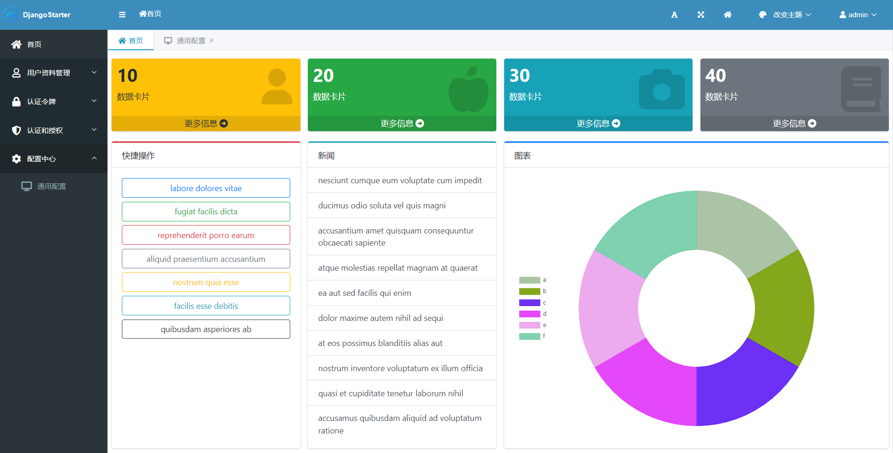

# Django Starter 基础框架 v3

DjangoStarter v3 是下一代 Django 项目快速开发模板，专为提升开发效率和性能而设计。

结合了 Django 的丰富功能和 Django-Ninja 的性能、灵活、简洁特性，v3 版本旨在为开发者提供一个更加强大、简洁和高速的开发体验。

通过这个全新的框架版本，开发者能够迅速搭建起符合现代 web 应用标准的项目基础架构。

更多新版本的细节，可以查看这篇博客: [关于正在开发中的DjangoStarter v3版本](https://blog.sblt.deali.cn:9000/Blog/Post/a21ab29f70708e15)



## 历史版本

- [v1](https://github.com/Deali-Axy/DjangoStarter/tree/v1)
- [v2](https://github.com/Deali-Axy/DjangoStarter/tree/v2)

## 核心特性

- **Django Ninja 集成**：采用 Django Ninja 替代传统的 Django Rest Framework，为 API 开发带来了性能优化和更简洁的编码体验。利用 Python 类型提示，自动生成交互式 API 文档，不再需要 drf-yasg 那一堆繁琐的手动配置文档，同时提升了代码的可读性和维护性。
- **增强的安全性**：内置了多项安全功能，包括但不限于 Admin 登录验证码、IP 限制等，确保应用的安全性。
- **代码自动生成**：v3 版本进一步优化了代码生成器，丢掉了 DRF 这个包袱，只需要定义模型，就可以生成 schema 以及 RESTFul API，还能根据定义自动创建测试用例，大大提高开发效率。
- **随机种子数据生成**：v3 版本内置 seed 模块，支持为已有模型自动填充假数据，方便开发测试。
- **模块化项目结构**：推出了更加模块化的项目结构设计，方便开发者根据需要添加或移除功能模块，使项目维护更为简单。
- **现代化前端集成**：提供了对现代化前端技术的集成，以及利用 NPM 和 gulp 管理前端资源，帮助开发者打造富交互式的用户界面。
- **容器化支持**：内置 Dockerfile 和 docker-compose.yml 配置，简化了容器化部署的过程，支持一键部署到任何支持 Docker 的环境。
- **详尽的文档与社区支持**：提供全面的文档和指南，覆盖从项目启动到部署的每一个步骤。同时，基于活跃的 Django 开源社区，开发者可以轻松获取支持和反馈。

## 适用场景

DjangoStarter v3 是为那些追求高效开发流程、重视应用性能与安全性的 Django 开发者设计的。无论是构建复杂的企业级应用、快速开发 MVP 还是学习最佳实践，DjangoStarter v3 都是一个优秀的选择。

## features

- **业务代码生成器**（新）
- admin后台安全限制中间件（需手动启用）
- 非debug模式下管理员可以查看报错信息（需手动启用）
- 自定义URL前缀
- 支持Docker部署（使用`docker-compose`方式）
- 支持uWsgi部署，支持uWsgi自动重启
- 默认启用`CORS_ALLOW`实现接口跨域
- 基于SimpleUI定制的管理后台
- 管理后台支持登录验证码和登录尝试次数限制
- 集成Django-Ninja实现RESTFul API
- 配置模块`settings.py`拆分，支持多环境配置
- 默认使用Redis缓存
- 默认集成Swagger文档，开箱即用，无需额外配置
- 集成了多种外部登录功能
- [集成微信SDK，支持(企业)微信登录，详见博客](https://www.cnblogs.com/deali/p/16110129.html)
- [接口返回值统一包装，详见博客](https://www.cnblogs.com/deali/p/16094959.html)
- [集成NPM和Gulp管理前端资源，详见博客](https://www.cnblogs.com/deali/p/16094743.html)
- [封装了常用的三种分页功能，详见博客](https://www.cnblogs.com/deali/p/16132905.html)
- [重写admin主页，界面更美观，详见博客](https://www.cnblogs.com/deali/p/16418020.html)
- 封装了简单的本地配置中心

## v3版本介绍

v2版本已经定下了大体的框架，v3的主要改动是将 RestFramework 换成了 django-ninja ，在 Django 里实现了 FastApi 风格的接口。

其他的功能目前大概是这些：

- 新的自动代码生成功能
- 完善了单元测试和集成测试，搭配代码生成，可以为每个应用自动生成 crud 的测试用例
- 随机种子数据，目前使用 faker 实现假数据，打算进一步实现类似 EFCore 的种子数据机制，使假数据更自然
- 新的登录接口
- 多种第三方登录接入（目前接了微信、小程序、企微）
- 使用 tailwindcss 替换 bootstrap 实现前端（只是一些简单的后台展示，还是以 API 为主）
- 拆分 settings 配置，像 AspNetCore 那样支持多个环境配置
- 更换了包管理器为 pdm

功能持续更新中，我会同步发在博客，欢迎关注。

## 文件结构

```sql
 DjangoStarter
 ├─ media # 用户上传的文件
 ├─ src # 主要源码
 │  ├─ apps # 所有应用
 │  │  ├─ account # 用户相关的代码，包括登录接口
 │  │  ├─ demo # 示例应用
 │  │  └─ __init__.py
 │  ├─ config # Django项目配置
 │  │  ├─ settings # 拆分的settings模块
 │  │  ├─ __init__.py
 │  │  ├─ apis.py # ninja API 配置
 │  │  ├─ asgi.py
 │  │  ├─ env_init.py # 环境初始化
 │  │  ├─ urls.py # 路由配置文件
 │  │  ├─ urls_root.py # DjangoStarter的顶层路由配置，用于实现地址前缀配置
 │  │  └─ wsgi.py
 │  ├─ django_starter # 框架代码
 │  │  ├─ contrib # 封装好的组件
 │  │  ├─ db # 数据库功能（比如 Model 基类）
 │  │  ├─ http # 接口相关（如 API 接口返回值包装）
 │  │  ├─ middleware # 中间件（IP限制、错误处理等功能）
 │  │  ├─ __init__.py
 │  │  ├─ apis.py
 │  │  ├─ constants.py
 │  │  ├─ urls.py
 │  │  └─ utilities.py
 │  ├─ static # 静态文件
 │  │  ├─ admin
 │  │  └─ css
 │  ├─ templates # Django模板
 │  │  ├─ demo
 │  │  └─ _base.html
 │  ├─ Dockerfile
 │  ├─ docker-compose.yml
 │  ├─ manage.py
 │  ├─ test.py
 │  └─ uwsgi.ini
 ├─ static-dist # 运行collectstatic命令后把所有静态文件都保存到这个文件夹
 ├─ .gitignore
 ├─ LICENSE
 ├─ README.md
 ├─ clean_pycache.py # 运行后可以清理 __pycache__ 文件
 ├─ gulpfile.js
 ├─ package.json
 ├─ pdm.lock
 ├─ pnpm-lock.yaml
 ├─ pyproject.toml
 └─ tailwind.config.js
```

## 快速开始

v3 版本开始我使用了 [pdm](https://pdm-project.org/en/latest/) 作为包管理器，这是一个现代化的包管理和项目管理工具，它专为 Python 项目设计，提供了诸如依赖解析、包安装以及虚拟环境管理等功能。

首先需要安装 pdm ，请参考官网的推荐安装方式进行安装，如果实在是懒得看官网可以按照本文档是懒人版方式安装。

关于 pdm 的一些扩展文档: [./docs/pdm-usage.md](docs/pdm-usage.md)

### 虚拟环境

推荐使用 conda 来管理 python 环境。

首先创建一个虚拟环境

```bash
conda create -n django-starter python=3.11
```

启用虚拟环境

```bash
conda activate django-starter
```

如果没有使用其他方式安装 pdm，可以使用 pip 安装 pdm 包管理器。

```bash
pip install pdm
```

### 安装依赖

#### Python 依赖

安装Python依赖：

```bash
pdm install
```

#### 前端资源

前端资源管理参考这篇博客：[使用NPM和gulp管理前端静态文件](https://www.cnblogs.com/deali/p/15905760.html)

安装前端依赖：

```bash
yarn install
# 或者使用 pnpm
pnpm i
```

打包前端资源：

```bash
gulp move
```

如果没有gulp请先安装：`npm install --global gulp-cli`

如果想使用 tailwindcss ，可以运行。

```bash
npx tailwindcss -i .\src\static\css\tailwind.src.css -o .\src\static\css\tailwind.css --watch
```

关于`tailwindcss`，详见这篇文章: [在 DjangoStarter 中集成 TailwindCSS](https://www.cnblogs.com/deali/p/18303538)

### 数据库迁移

```
python manage.py makemigrations
python manage.py migrate
```

### 配置缓存

本项目的限流、安全限制等功能依赖Redis、Memcache等缓存服务，这里以Redis为例。

先在本机安装Redis服务，即可正常使用。

如果要自定义Redis服务器，可以编辑 `config/caches.py` 文件，修改以下配置。

```python
'LOCATION': [
    'redis://redis:6379/0' if is_docker else 'redis://localhost:6379/0',
]
```

支持一主多从，默认是单Redis，会自动根据是否docker环境来切换服务器，请根据实际情况自行配置。

更多配置请参考Django文档: https://docs.djangoproject.com/en/4.1/topics/cache/

### 配置URL前缀

在环境变量中指定`URL_PREFIX`地址前缀

部署应用需要在`docker-compose.yml`文件中修改这个环境变量

运行应用后，会自动在所有URL前加上前缀，如管理后台的地址

添加URL前缀之前：

```
http://127.0.0.1/admin
```

添加URL前缀（如 test）之后：

```
http://127.0.0.1/test/admin
```

### 开始写业务逻辑

- **根据实际业务在`apps`包中创建新的应用并使用代码生成器生成CRUD代码（推荐）**
- ~~在默认应用`apps/demo`里写~~（不推荐）

使用`django-admin`命令创建app：

```bash
cd apps
django-admin startapp [your_app_name]
```

仿照`apps/demo`里的逻辑进行业务开发，每个App需要完成以下代码开发：

- `models.py`

**建议使用DjangoStarter代码生成器来生成这些重复的业务代码**（见下节）

之后在`config/apis.py`中注册 Ninja 路由。

需要在Django后台进行管理的话，在`admin.py`中进行注册，参考`apps/demo/admin.py`。

### 随机种子数据生成

DjangoStarter 内置种子数据生成功能，可以在开发环境下快速在数据库中填充随机假数据，方便测试。

使用以下命令即可自动生成

```bash
python manage.py seed app_label 10
```

其中 app_label 是开发者自行创建的 App 名称，比如 DjangoStarter 中的示例应用 demo

### 使用代码生成器

DjangoStarter 内置业务代码生成器，开发者只需要专注于编写最核心的 `models.py` 完成模型定义，其他代码自动生成，减少重复劳动，解放生产力。

#### 设计模型

首先完成 `models.py` 里的模型设计，编写规范可以参照 `apps/demo/models.py`。

下面是一个简单的模型设计例子：

```python
from django.db import models


class Author(models.Model):
    name = models.CharField('作者名称', max_length=20)

    def __str__(self):
        return self.name

    class Meta:
        verbose_name = '作者'
        verbose_name_plural = verbose_name


class Article(models.Model):
    name = models.CharField('文章名称', max_length=20)
    content = models.TextField('文章内容')
    author = models.ForeignKey('Author', verbose_name='文章作者', on_delete=models.CASCADE)

    def __str__(self):
        return self.name

    class Meta:
        verbose_name = '文章'
        verbose_name_plural = verbose_name
```

#### 模型设计的基本要求

- 每个字段加上友好的 `verbose_name` ，一般是中文名
- 定义 `__str__` ，便于在管理后台中表示这个模型的对象
- 定义 `Meta` 元类，给模型加上一个更友好的名称（一般是中文名）

#### 注册应用

设计好了Model，需要把其App添加到`INSTALLED_APPS`才能被扫描到。

编辑`config/settings.py`文件，在`INSTALLED_APPS`节点添加应用，里面有注释，一看就懂。

#### 运行代码自动生成

运行命令：

```bash
python manage.py autocode [app_label] [verbose_name]
```

参数说明：

- `app_label`: App名称，之前运行 `django-admin` 命令创建的App名称
- `verbose_name`: 和模型的 `verbose_name` 类似，App的友好名称，一般是其中文名

**注意：运行自动代码生成会覆盖已有的业务代码！**

自动代码生成会创建(覆盖)以下文件：

- `apis` 目录下，按照每个 model 一个 python package 自动生成 ninja 的 crud 代码
- `__init__.py`
- `admin.py`
- `apps.py`
- `tests.py`

#### 添加路由

代码生成器会生成你需要的所有代码，之后在`config/apis.py`文件中添加路由：

```python
# 根据你的 App 名称和路径，引入 router
from apps.demo.apis import router as demo_router

# 添加到 ninja 的路由配置里
api.add_router('demo', demo_router)
```

### 访问接口文档

本项目使用 django-ninja 实现 API 接口，其提供了 OpenAPI 的集成功能。

启动项目之后访问 http://localhost:8000/api/doc 即可查看和进行接口测试

## 配置

### 配置Django后台网站名称

编辑`config/django_starter.py`文件，修改这三行代码：

```bash
'admin': {
  'site_header': 'DjangoStarter 管理后台',
  'site_title': 'DjangoStarter',
  'index_title': 'DjangoStarter',
  'list_per_page': 20
}
```

> PS: 本项目的后台界面基于SimpleUI，更多Django后台配置方法请参考SimpleUI官方文档。

### 配置App在后台显示的名称

编辑每个App目录下的`apps.py`文件，在`[AppName]Config`类里配置`verbose_name`，然后在App目录下的`__init__.py`中，设置`default_app_config`
即可，具体参照`apps/demo`的代码。

### 配置app在swagger中的说明

编辑`config/swagger.py`文件，在`CustomOpenAPISchemaGenerator`类的`get_schema`方法中配置`swagger.tags`即可。

### 限流配置

编辑`config/rest_framework.py`文件 ，参照注释说明修改`DEFAULT_THROTTLE_RATES`节点即可。

### 中间件

#### 配置启用*admin后台安全限制中间件*

编辑`django_starter/middleware/admin_secure.py`文件，在`AdminSecureMiddleware`类可修改以下两个字段进行配置：

- `allow_networks`：配置IP段白名单
- `allow_addresses`：配置IP地址白名单

编辑`config/settings.py`文件，在`MIDDLEWARE`节点中添加`django_starter.middleware.admin_secure.AdminSecureMiddleware`即可启用安全限制中间件。

#### 配置启用*非debug模式下管理员可以查看报错信息*

编辑`config/settings.py`文件，在`MIDDLEWARE`节点中添加`django_starter.middleware/user_base_exception.UserBasedExceptionMiddleware`即可。

## 部署

### 收集静态文件

```bash
python manage.py collectstatic
```

把 `static_collect` 目录上传

### docker 部署

根据需要修改 `docker-compose.yaml` 文件

然后启动

```bash
docker compose up --build
```

### uWsgi自动重启

在`uwsgi.ini`配置文件中，本项目已经配置了监控`readme.md`文件，文件变化就会自动重启服务器，因此在生产环境中可以通过修改`README.md`文件实现优雅的uwsgi服务重启。

## TODO

- [x] 集成IP段限制中间件
- [x] 集成企业微信第三方登录
- [x] 集成微信公众号SDK
- [x] 集成小程序登录功能
- [x] 集成消息队列
- [x] 进一步优化`settings`拆分 (基于 `django-split-settings`)
- [x] 完善项目单元测试
- [ ] 使用自动构建部署工具
- [x] 种子数据: 自动为已有模型生成假数据
- [ ] 种子数据: 允许用户自行定义种子数据(类似EFCore)
- [x] 代码生成器: 自动生成业务代码
- [x] 代码生成器: 自动生成单元测试和集成测试代码
- [x] 使用yarn+gulp管理前端资源
- [x] 框架功能集成在`django_starter`包中

## 相关博文

公众号 | 公众号 |
------- | ------ | 
 |    |

公众号专辑：[Django开发精选](https://mp.weixin.qq.com/mp/appmsgalbum?__biz=MzI3MjQ5ODU0Mg==&action=getalbum&album_id=1409752252860022785&subscene=126&scenenote=https%3A%2F%2Fmp.weixin.qq.com%2Fs%3F__biz%3DMzI3MjQ5ODU0Mg%3D%3D%26mid%3D2247485662%26idx%3D1%26sn%3D3dfeb8a077220afb3607abcf9dc03eb9%26chksm%3Deb30e2dfdc476bc94ad3d4314591eeb74b1a3340aaff763af81e8aa3aeb13433ad63d14f382c%26scene%3D126%26sessionid%3D1594189969%26key%3D6d309a22c00ffb6bef9cc0b9cd5a125d1e6e57036758e1406e9eb444f50e9b700fbfbda8deaa1bfc431da4096bcd3b716f4f3fbaf30d1cb13aa779da9a32cd5cb7dabfd8d4069be6e23c19759f34c9e5%26ascene%3D1%26uin%3DMjQ1NzIyMjgw%26devicetype%3DWindows%2B10%2Bx64%26version%3D62090523%26lang%3Dzh_CN%26exportkey%3DA41f2%252BxPyxQC8LkTcD3p2O0%253D%26pass_ticket%3DtRJAFFF0qD2j0C9V0754yCDjHLxEraPHwEk%252BG2geCzI%253D%26winzoom%3D1.25#wechat_redirect)

知乎专栏：[程序设计实验室](https://www.zhihu.com/column/deali)

Django博客合集：https://www.cnblogs.com/deali/category/1799362.html

- [聊聊Django应用的部署和性能的那些事儿](https://zhuanlan.zhihu.com/p/152679805)
- [给Django Admin添加验证码和多次登录尝试限制](https://zhuanlan.zhihu.com/p/138955540)
- [Python后端日常操作之在Django中「强行」使用MVVM设计模式](https://zhuanlan.zhihu.com/p/136571773)
- [Python后端必须知道的Django的信号机制！](https://zhuanlan.zhihu.com/p/135361621)
- [一小时完成后台开发：DjangoRestFramework开发实践](https://zhuanlan.zhihu.com/p/113367282)
- [Django快速开发实践：Drf框架和xadmin配置指北](https://zhuanlan.zhihu.com/p/100135134)
- [DjangoAdmin使用合集，DjangoAdmin的功能比你想象的强大！](https://www.cnblogs.com/deali/p/16678014.html)
- [轻量级消息队列 Django-Q 轻度体验](https://www.cnblogs.com/deali/p/16644989.html)

## LICENSE

```
Apache License Version 2.0, January 2004
http://www.apache.org/licenses/
```
